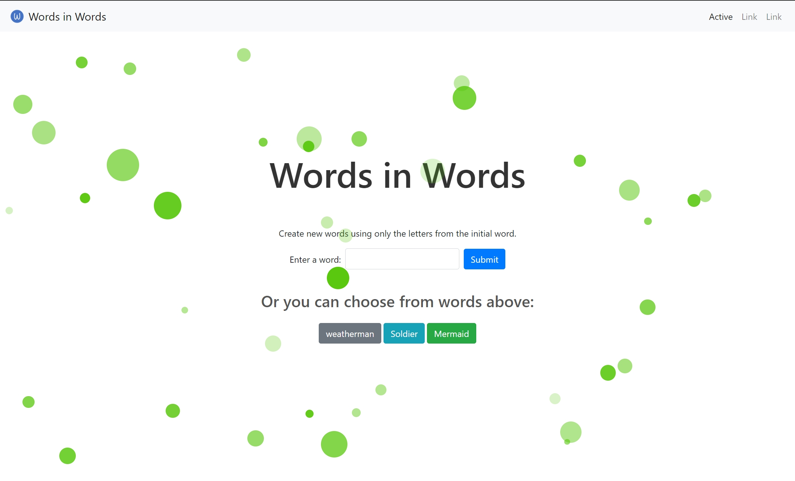

### Application Description

This game allows users to find new words by using letters from existing words. When a user inputs a word, the page automatically splits the word into individual letters. Users can then interactively click on the letters displayed on the screen or directly input them into the designated input box.

### Word Matching

The entered word is matched against a dictionary stored in the database. The dictionary consists of the top 10,000 English words and includes information such as parts of speech and explanations for each word.

### Technologies Used
Frontend: HTML, CSS, JavaScript
Backend: PHP, MySQL
Frameworks: Bootstrap (for styling), Express (for server)

